```{r, include=FALSE}
library(knitr)
riv.seg <- params$riv.seg
dat.source1 <- params$dat.source1
dat.source2 <- params$dat.source2
start.date <- params$start.date
end.date <- params$end.date
github_link <- params$github_link
site <- params$site
site.or.server <- params$site.or.server
run.id1 <- params$run.id1
run.id2 <- params$run.id2
gage_number <- params$gage_number
mod.phase1 <- params$mod.phase1
mod.scenario1 <- params$mod.scenario1
mod.phase2 <- params$mod.phase2
mod.scenario2 <- params$mod.scenario2
```

```{r, include=FALSE}
cbp6_link <- paste0(github_link, "/cbp6/code");
source(paste0(cbp6_link,"/cbp6_functions.R"))
source(paste(github_link,"auth.private", sep = "/"));#load rest username and password, contained in
source(paste(cbp6_link, "/fn_vahydro-1.0.R", sep = ''))
token <- rest_token(site, token, rest_uname, rest_pw);
options(timeout=1200); # set timeout to twice default level to avoid abort due to high traffic

# LOADING DATA ------------------------------------------------------------
if (dat.source1 == 'vahydro') {
  data1 <- vahydro_import_data_cfs(riv.seg, run.id1, token, site, start.date, end.date)
} else if (dat.source1 == 'gage') {
  data1 <- gage_import_data_cfs(gage_number, start.date, end.date)
} else if (dat.source1 == 'cbp_model') {
    if (site.or.server == 'site') {
      data1 <- model_import_data_cfs(riv.seg, mod.phase1, mod.scenario1, start.date, end.date)
    } else if (site.or.server == 'server') {
      data1 <- model_server_import_data_cfs(riv.seg, mod.phase1, mod.scenario1, start.date, end.date)
    }
}

if (dat.source2 == 'vahydro') {
  data2 <- vahydro_import_data_cfs(riv.seg, run.id2, token, site, start.date, end.date)
} else if (dat.source2 == 'gage') {
  data2 <- gage_import_data_cfs(gage_number, start.date, end.date)
} else if (dat.source2 == 'cbp_model') {
    if (site.or.server == 'site') {
      data2 <- model_import_data_cfs(riv.seg, mod.phase2, mod.scenario2, start.date, end.date)
    } else if (site.or.server == 'server') {
      data2 <- model_server_import_data_cfs(riv.seg, mod.phase2, mod.scenario2, start.date, end.date)
    }
}

# TRIMMING DATA TO PROPER WATER YEAR
data1 <- water_year_trim(data1)
data2 <- water_year_trim(data2)
```

```{r, include = FALSE}
if (dat.source1 == 'vahydro') {
  title.part.1 <- paste('VA Hydro Run ', run.id1, sep = '')
} else if (dat.source1 == 'gage') {
  title.part.1 <- paste('USGS Gage ', gage_number, sep = '')
} else if (dat.source1 == 'cbp_model') {
  title.part.1 <- paste('Scenario ', mod.scenario1, sep = '')
}

if (dat.source2 == 'vahydro') {
  title.part.2 <- paste('VA Hydro Run ', run.id2, sep = '')
} else if (dat.source2 == 'gage') {
  title.part.2 <- paste('USGS Gage ', gage_number, sep = '')
} else if (dat.source2 == 'cbp_model') {
  title.part.2 <- paste('Scenario ', mod.scenario2, sep = '')
}

dashboard_title <- paste('River Segment ', riv.seg, ': ', title.part.1, ' vs. ', title.part.2, sep = '')
```

---
title: "`r dashboard_title`"
header-includes:
  - \usepackage{titling}
  - \pretitle{\begin{flushleft}}
  - \posttitle{\end{flushleft}}
output:
  pdf_document

---

```{r,  include=FALSE}
# Creating Data Frame with calculated metrics 
metrics1 <- metrics_calc_all(data1)
metrics2 <- metrics_calc_all(data2)

percent_difference <- metrics_compare(metrics1, metrics2, riv.seg)

all_data <- all_data_maker(data1, data2)
```

```{r,  include=FALSE}
# Creating all tables
Table1 <- tab1.monthly.low.flows(percent_difference)
Table2 <- tab2.monthly.average.flows(percent_difference)
Table3 <- tab3.monthly.high.flows(percent_difference)
Table4 <- tab4.period.low.flows(percent_difference)
Table5 <- tab5.period.high.flows(percent_difference)
Table6 <- tab6.nonexceedence.flows(percent_difference)
```

```{r, include=FALSE}
# Creating all plots
fig1.hydrograph(all_data)
fig2.zoomed.hydrograph(all_data)
fig3.flow.exceedance(all_data)
fig4.baseflow.hydrograph(all_data)
fig5.combined.hydrograph(all_data)
OUTPUT_MATRIXsaver <- figs6to8.largest.diff.periods(all_data)
fig9a.residual.plot(all_data)
fig9b.area.weighted.residual.plot(all_data, riv.seg, token, site)
fig10.runit.boxplot(riv.seg, run.id = run.id1, token, site, start.date, end.date)
figs11to13.smallest.diff.periods(all_data)
```

```{r, echo = FALSE, warning = FALSE, message = FALSE, include=FALSE}
description <- try(read_file(paste0(cbp6_link, "/gage_descriptions/", gage_number, ".txt")))
if (class(description) == "try-error") {
  description <- ""
}
description.cont <- paste0(" The average daily discharge change between scenario 1 and scenario 2 for the 20 year timespan was ", OUTPUT_MATRIXsaver[2] ,"%, with ", OUTPUT_MATRIXsaver[1], "% of its rolling three month time spans above 20% difference.")
```

```{r, echo=FALSE, warning=FALSE, message=FALSE, out.width='95%'}
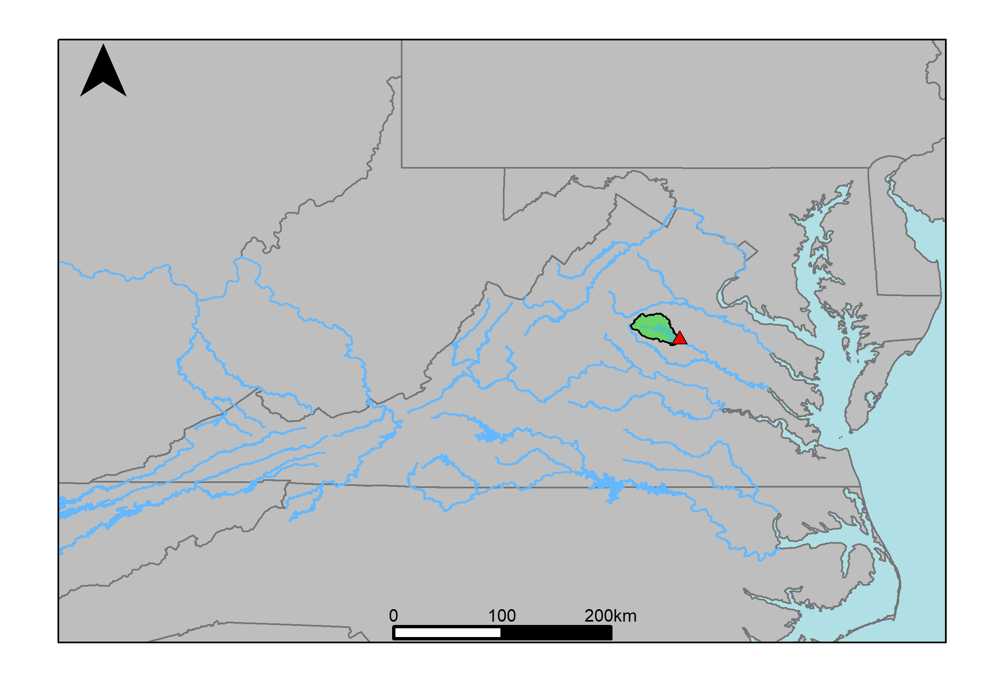
```

```{r, results = 'asis', echo=FALSE, warning=FALSE, message=FALSE}
# Loading written gage description
cat(description)
cat(description.cont)
```

\pagebreak

## Table 1: Monthly Low Flows
```{r, echo=FALSE, warning=FALSE, message=FALSE}
Table1
```

## Table 2: Monthly Average Flows
```{r, echo=FALSE, warning=FALSE, message=FALSE}
Table2
```

## Table 3: Monthly High Flows
```{r, echo=FALSE, warning=FALSE, message=FALSE}
Table3
```

## Table 4: Period Low Flows
```{r, echo=FALSE, warning=FALSE, message=FALSE}
Table4
```

## Table 5: Period High Flows
```{r, echo=FALSE, warning=FALSE, message=FALSE}
Table5
```

## Table 6: Non-Exceedance Flows
```{r, echo=FALSE, warning=FALSE, message=FALSE}
Table6
```

## Fig. 1: Hydrograph
```{r, echo=FALSE, warning=FALSE, message=FALSE, out.width="95%"}
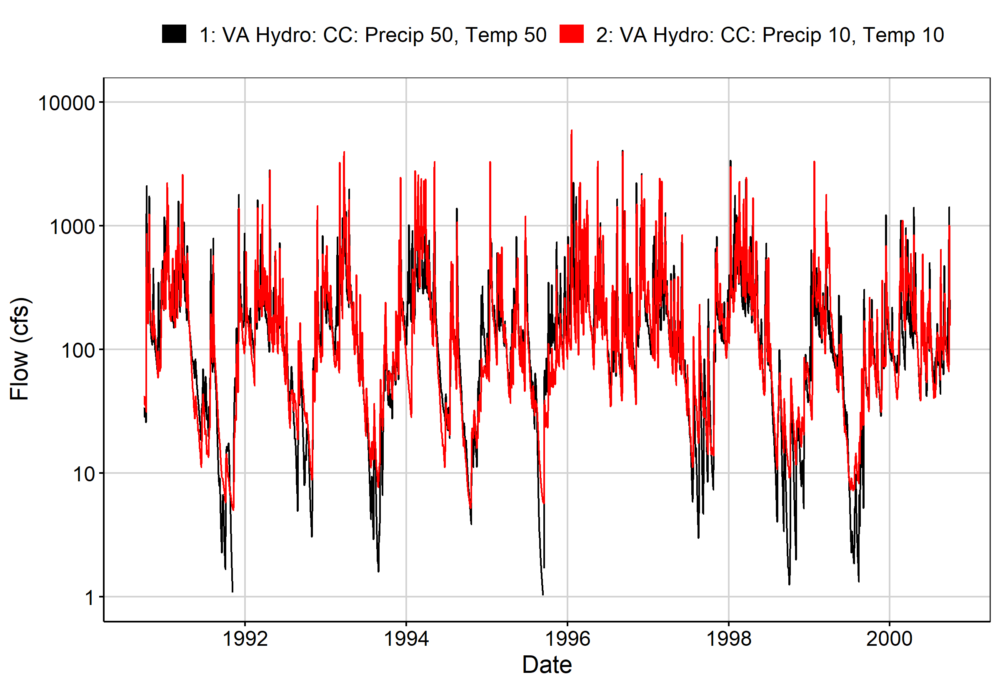
```

# Fig. 2: Zoomed Hydrograph
```{r, echo=FALSE, warning=FALSE, message=FALSE, out.width="95%"}
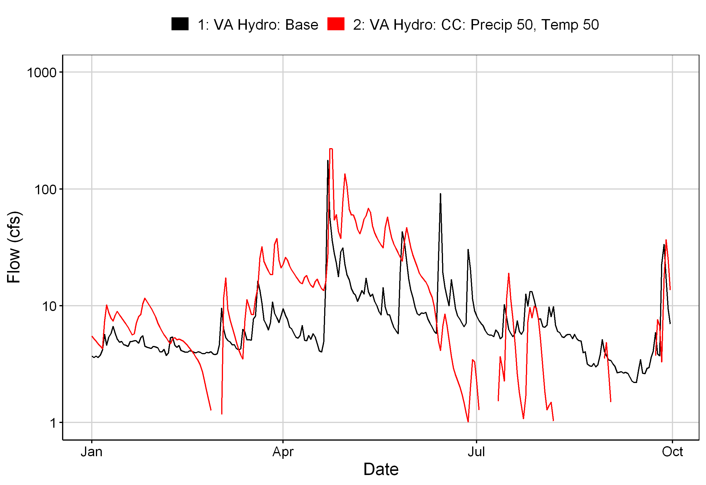
```

# Fig. 3: Flow Exceedance
```{r, echo=FALSE, warning=FALSE, message=FALSE, out.width="95%"}
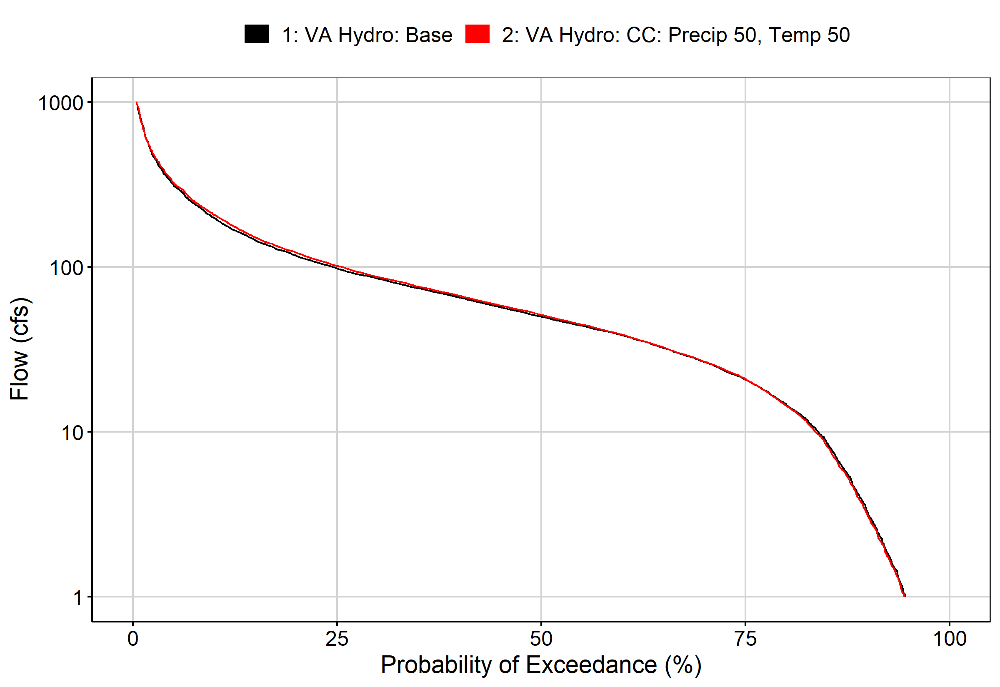
```

# Fig. 4: Baseflow
```{r, echo=FALSE, warning=FALSE, message=FALSE, out.width="95%"}
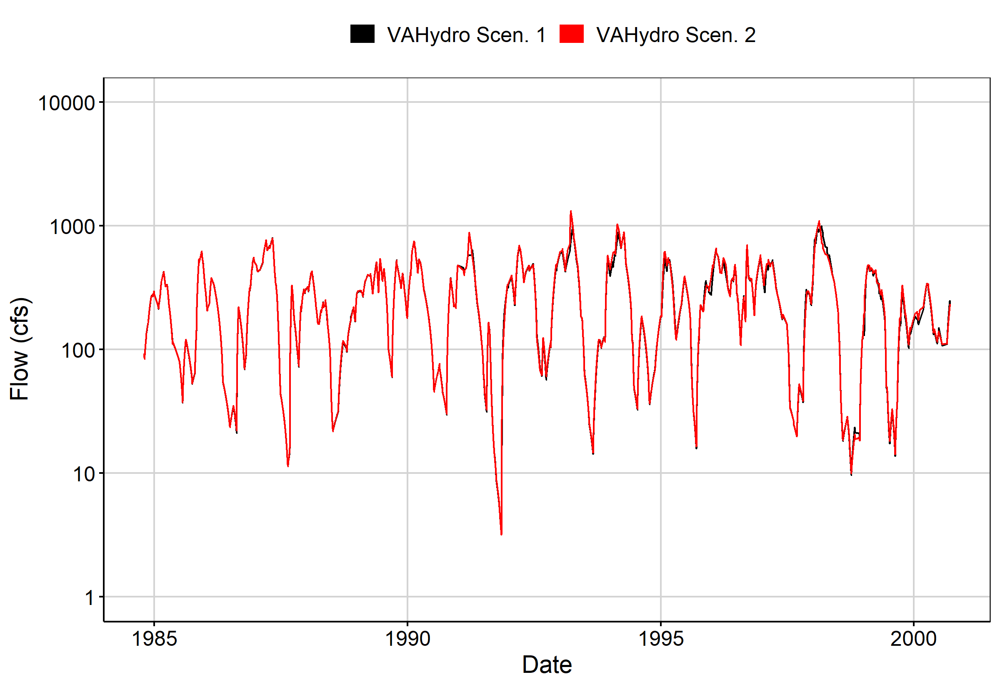
```

# Fig. 5: Combined Baseflow
```{r, echo=FALSE, warning=FALSE, message=FALSE, out.width="95%"}
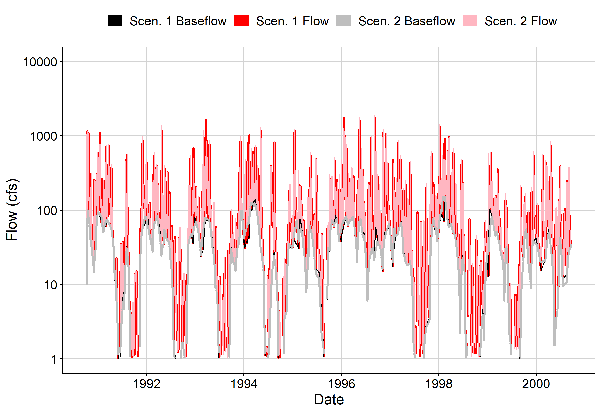
```

# Fig. 6: Largest Difference Period
```{r, echo=FALSE, warning=FALSE, message=FALSE, out.width="95%"}
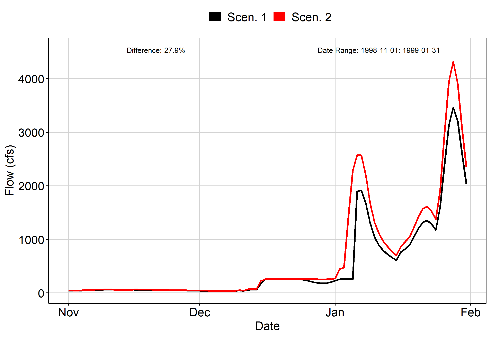
```

# Fig. 7: Second Largest Difference Period
```{r, echo=FALSE, warning=FALSE, message=FALSE, out.width="95%"}
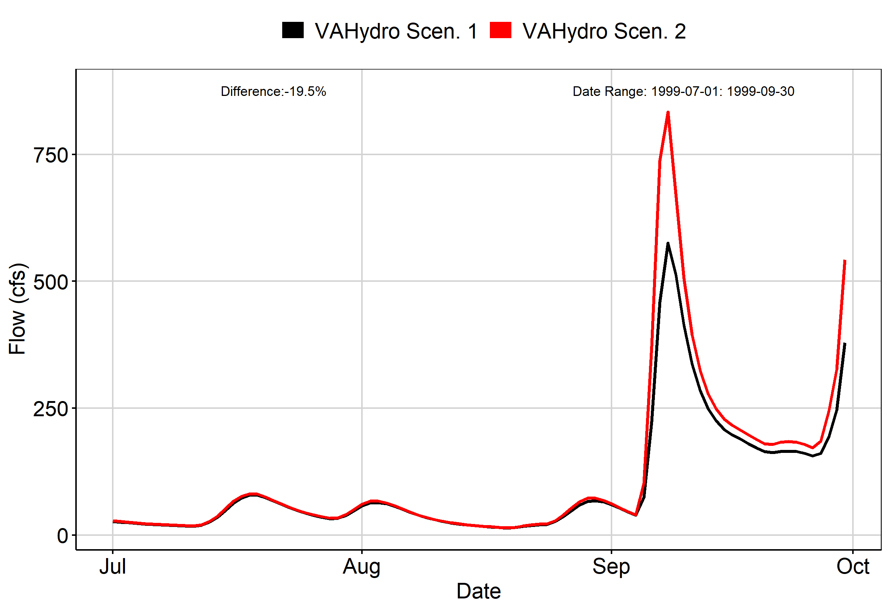
```

# Fig. 8: Third Largest Difference Period
```{r, echo=FALSE, warning=FALSE, message=FALSE, out.width="95%"}
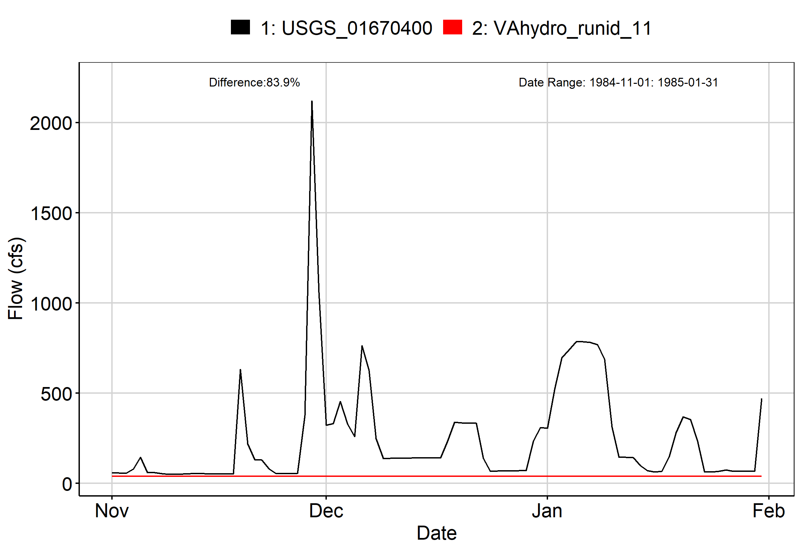
```

# Fig. 9A: Residuals Plot
```{r, echo=FALSE, warning=FALSE, message=FALSE, out.width="95%"}
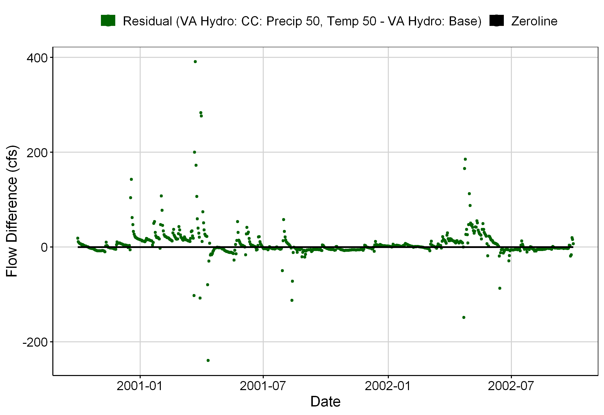
```

# Fig. 9B: Area Weighted Residuals Plot
```{r, echo=FALSE, warning=FALSE, message=FALSE, out.width="95%"}
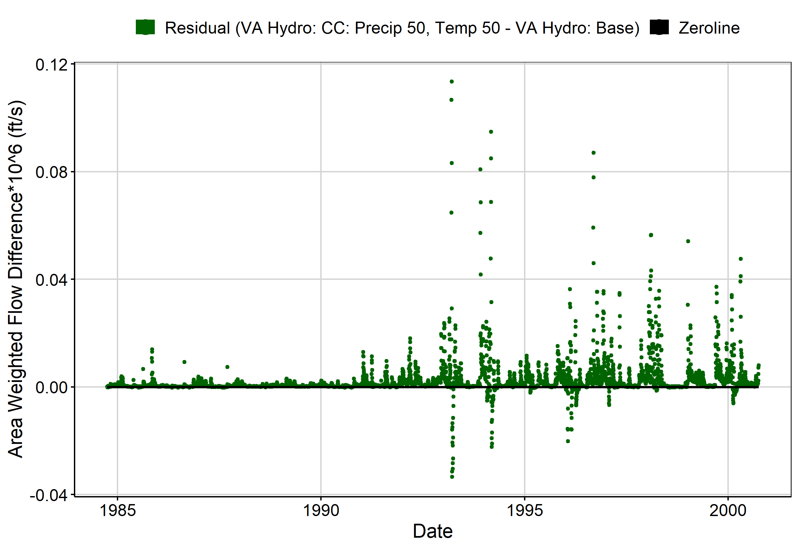
```

# Fig. 10: VA Hydro Scen. 1 Runit Values (Outliers Excluded)
```{r, echo=FALSE, warning=FALSE, message=FALSE, out.width="95%"}
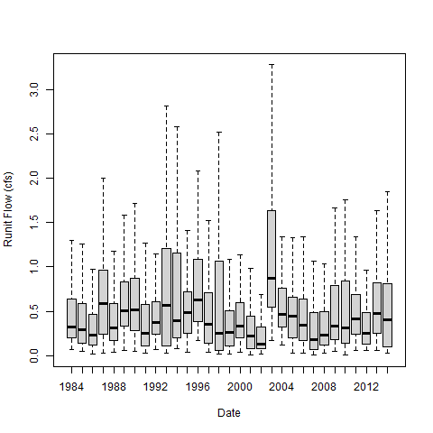
```

# Fig. 11: Smallest Difference Period
```{r, echo=FALSE, warning=FALSE, message=FALSE, out.width="95%"}
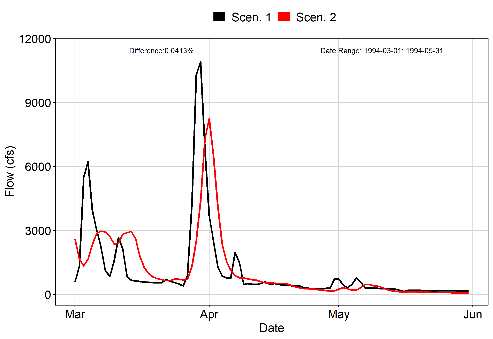
```

# Fig. 12: Second Smallest Difference Period
```{r, echo=FALSE, warning=FALSE, message=FALSE, out.width="95%"}
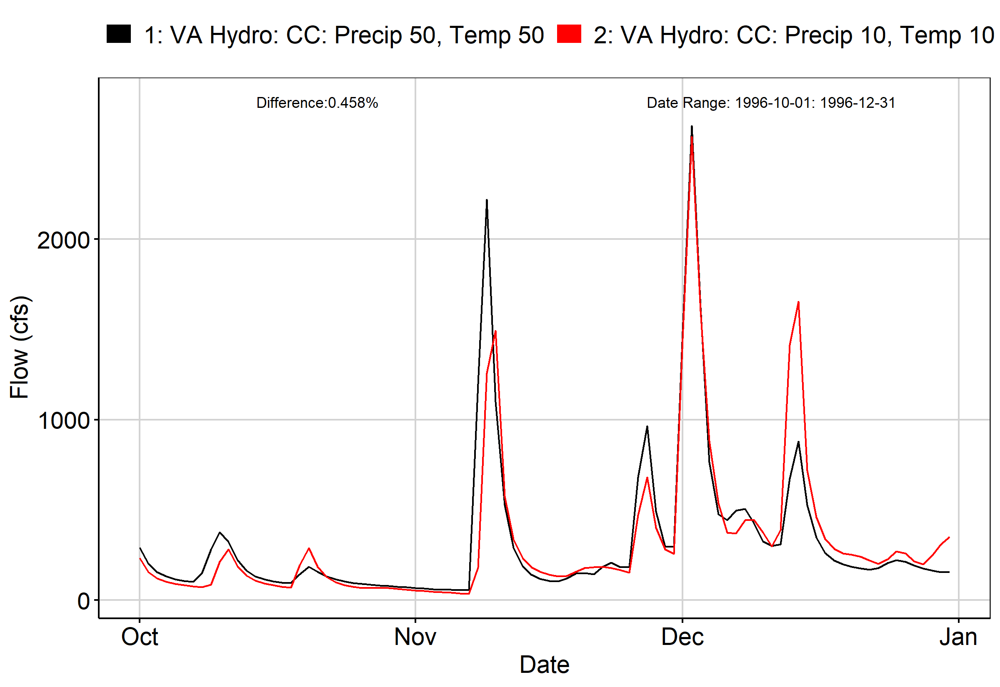
```

# Fig. 13: Third Smallest Difference Period
```{r, echo=FALSE, warning=FALSE, message=FALSE, out.width="95%"}
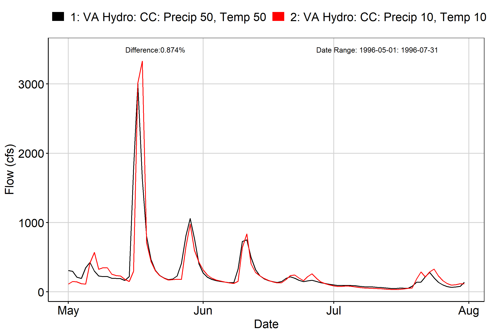
```